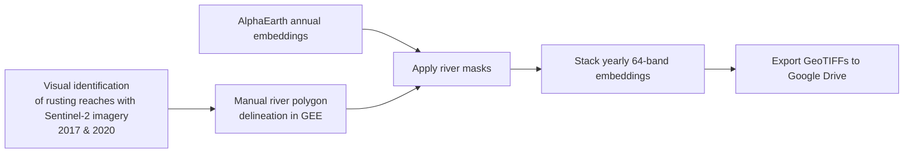
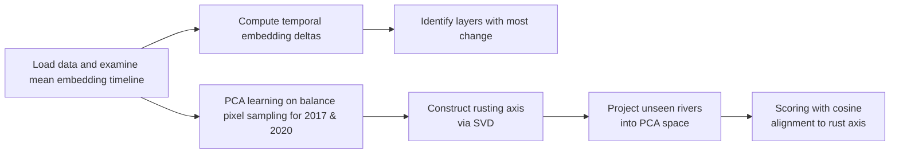

<!-- Improved compatibility of back to top link: See: https://github.com/othneildrew/Best-README-Template/pull/73 -->

<h1 align="center">Arctic River Rusting Detection using AlphaEarth Embeddings</h1>

    Using Principal Component Analysis (PCA) on high-dimensional ML products.
  

 
<!-- TABLE OF CONTENTS -->

  
Table of Contents

  <ol>
    <li>
      <a href="#about-the-project">About The Project</a>
      <ul>
        <li><a href="#background">Background</a></li>
        <li><a href="#the-sentinel-2-satellite">The SENTINEL-2 Satellite</a></li>
        <li><a href="#machine-learning-methodology-k-means-clustering">Machine Learning Methodology: K-Means Clustering</a></li>
      </ul>
    </li>
    <li>
      <a href="#getting-started">Getting Started</a>
      <ul>
        <li><a href="#datasets-used">Datasets Used</a></li>
      </ul>
    </li>
    <li><a href="#usage">Usage</a></li>
    <li><a href="#license">License</a></li>
    <li><a href="#contact">Contact</a></li>
    <li><a href="#acknowledgments">Acknowledgments</a></li>
      <ul>
        <li><a href="#references">References</a></li>
      </ul>
  </ol>

# About the Project
This project is a final assignment for GEOL0069 at University College London, created to explore the usage of machine learning (ML) algorithms in Earth Sciences applications. It presents a scalable framework for detecting and characterising river rusting across Arctic environments using Google's Alpha Earth machine learning embeddings. The unsupervised learning method used to intepret the data is Principal Component Analysis (PCA).

## Background
The approach is inspired by the findings of O'Donell et al. (2024), [*"Metal mobilization from thawing permafrost to aquatic ecosystems is driving rusting of Arctic streams"*](https://www.nature.com/articles/s43247-024-01446-z#auth-Jonathan_A_-O_Donnell-Aff1), which identified widespread river colour changes linked to permafrost thaw in Alaska. Acid rock drainage conditions leading to iron and toxic heavy metal mobilisation are observed as previously frozen soil is exposed to an oxidizing environment. Iron-rich groundwater released from thawing permafrost alters river optical properties, producing strong orange-brown discolouration detectable from satellite imagery. 

<figure>
  
  <figcaption><i>Figure 1: Visualisation of river rusting and iron mobilisation detected via satellite imagery (O'Donell et al., 2024).</i></figcaption>
</figure>

### Motivation
There is a need for a larger database of rusting rivers, to study this phenomenon and better monitor the associated environmental risks. Most existing detection approaches rely on local case studies, RGB visual interpretation and manually selected spectral bands. Improved methods would benefit from integrating high-dimensional contextual information to scale efficiently to continental monitoring. O'Donell et al. (2024) produced timelines of rusting change for three rivers which are used in this project to train an unsupervised learning model. Google's AlphaEarth satellite embeddings are used in this project. Embeddings encode spectral structure and contextual landscape information from lots of satellite products into multi-band latent representations that can be analysed statistically. This enables the design of a large scale detection framework.

This repository explores whether rusting rivers exhibit coherent trajectories in embedding space that can be learned and generalised, using
* pixel-level statistical analysis
* unsupervised learning using Principal Component Analysis (PCA) and Singular Value Decomposition (SVD)
* projection onto a learned universal rusting axis

The goal of this project is to build an Arctic-scale rusting river monitoring and detection framework capable of identifying anomalous river colour trajectories over time.

### Conceptual Framework

The framework treats river rusting as a directional trajectory in embedding space.

Instead of classifying rivers directly from imagery, the workflow:

1. extracts pixel-level embeddings from rusting rivers
2. compares embedding states between 2017 and 2020, the biggest change observed in timeline (Figure 1)
4. computes temporal displacement vectors
5. learns dominant rusting directions using PCA/SVD
6. projects unseen rivers into this learned change space

The central hypothesis is:

> Rusting rivers occupy a coherent directional manifold in embedding-change space that differs from normal temporal variability.

## Workflows

### Data Extraction and Filtering in Google Earth Engine (GEE)

### Analysis and Rusting Detection (Python / Colab)

---

### 1. Data Sources and Extraction Pipeline

#### Sentinel-2 Imagery for Rusting Delineation

River polygons were manually digitised in GEE. Sentinel-2 surface reflectance imagery (`COPERNICUS/S2_HARMONIZED`) was first used within GEE to visually identify and constrain river sections exhibiting rusting behaviour between 2017 and 2020.

For each study river:

- cloud-minimised summer composites were generated for both 2017 and 2020
- RGB visualisations (`B4`, `B3`, `B2`) were compared interactively
- river reaches exhibiting visible orange-brown discolouration were manually delineated using polygon masks

These masks were intentionally constrained to the visibly affected river pixels to  provide spatially targeted training data for embedding-space analysis. This minimises inclusion of unaffected reaches, reduces mixed land-water pixels and isolates regions undergoing observable optical change.

#### AlphaEarth Embeddings

Embeddings are obtained within GEE from:

`GOOGLE/SATELLITE_EMBEDDING/V1/ANNUAL`

Each pixel contains a 64-dimensional representation encoding spatial and spectral structure.
Embedding data was masked and clipped to the river polygons to isolate the water surface, before being exported as a individual GeoTiff files for further analysis (64 layers & 9 years for every pixel).

### 2. Data Preparation and Pixel-Level Embedding Extraction

For each river:
- embedding pixels were sampled from AlphaEarth 64-dimensional annual embeddings
- only pixels valid in both 2017 and 2020 were retained
- pixel sets were balanced across rivers to ensure equal contribution during analysis

This produced paired embedding matrices:
- $x_{2017}$: pixel-level embeddings for 2017
- $x_{2020}$: corresponding embeddings for 2020

### 3. Temporal Change Analysis

An initial analysis of mean changes in embeddings was performed on the three rusting rivers.

$$
\Delta x = x_{2020} - x_{2017}
$$

where:

- $x$ is a 64-dimensional embedding
- $\Delta x$ represents mean movement accross 64 layers 2017 and 2020

There was no obvious changes in embedding structure over time during the study period.

In addition to temporal change over the entire period, embedding changes between 2017 and 2020 were examined to identify which embedding layers exhibited the largest magnitude of change. While no layer single-handedly explains rusting, layer 35 was in the top 6 among all rusting rivers. 

### 4. PCA Representation Learning

Principal Component Analysis (PCA) was applied to the combined pixel-level embedding dataset (2017 and 2020 stacked together) to learn a low-dimensional representation of the embedding space.

This step was used to:

- reduce dimensionality of the 64-band embedding space
- provide a shared coordinate system for both years
- enable visualisation of temporal trajectories with vectors of mean displacement from 2017 to 2020

The resulting change vectors were consistent in direction within the resulting PC1/PC2 2D space. This indicates a common direction of change among rusting rivers, to be verified with controls (step 6).

This PCA space was used as a reference frame for all subsequent analysis.

### 5. Rust Axis Construction

A dominant direction of temporal change (“rust axis”) was estimated using Singular Value Decomposition (SVD) applied to the displacement vectors:

$$
r = \text{dominant direction of } \Delta x
$$

This axis represents the primary coherent direction of embedding change associated with river rusting behaviour across the sampled rivers. 

### 6. Projection Scoring in PCA Space and Control Rivers

Three control rivers were used to verify the specificity of the primary direction of change to rusting rivers. The control rivers were chosen as streams which did not exhibit rusting (based on Sentinel-2 analysis) located within 20km of the three rusting rivers. Data extraction was done in the same manner as rusting rivers.

Control rivers were plotted in PCA space and mean temporal displacements were computed as above.

Each river (rusting and control) was scored by measuring alignment with the rust axis using cosine similarity:

- high alignment → consistent rusting-like behaviour
- low or negative alignment → weak or opposite change direction

This provided a quantitative measure of directional change consistency across rusting rivers (over 90% similarity). Controls scored between 10-80%.

### Interpretation of the Approach

This workflow implements a **data-driven embedding analysis pipeline** where river rusting is treated as a directional shift in high-dimensional feature space.

Unlike classification-based approaches, this method:

- operates directly on temporal embedding differences
- does not require explicit labels for rusting intensity
- uses PCA as a shared representation space
- defines rusting as a dominant vector of change rather than a binary class

### Limitations

- Rust axis is derived from observed rivers only
- Potential sensitivity to sampling variability
- Controls are identified from satellite images only, ground truthing would be ideal.

## Planned Extensions

Future work should include:

* use of Arctic-wide river-network shapefiles
* automated river polygon generation, clipping shapefile to a 20km grid
* extraction of embedding for each clipped river segment
* projection of embeddings in the PCA space learned in this notebook.
* computation of probabilistic rusting likelihood scores
* spatial clustering of rusting hotspots
* further work on explaining embedding decomposition

By projecting embeddings of candidate rivers to the rusting axis learned in this project, rusting rivers can be identified at large scale. This framework would benefit from additional ground data to train the PCA model on additional rusting timelines.

---
# Getting Started

This project was created using [Google Colab]([https://colab.research.google.com/]), a cloud-based platform for modifying and sharing code. To get a copy of this project up and running, follow these steps:
1. Download `Rusting_Rivers.ipynb` from this repository to get started.
2. Download datasets to use. See below for how to acquire datasets.
3. Modify file paths in the Colab notebook to match the location where the dataset was saved. 
4. Run the cells of the notebook sequentially. Further instructions can be found in the notebook.

<!-- LICENSE -->
# License

Distributed under the MIT License. See `LICENSE.txt` for more information.

(<a href="#readme-top">back to top</a>)

<!-- CONTACT -->
# Contact

Benjamin Guillaud-Leblanc - [ben.guillaud-leblanc.22@ucl.ac.uk](mailto:ben.guillaud-leblanc@ucl.ac.uk) / [ben.guillaud@protonmail.com](mailto:ben.guillaud@protonmail.com) / [www.linkedin.com/in/benjamin-guillaud-leblanc](http://www.linkedin.com/in/benjamin-guillaud-leblanc)

Project Link: https://github.com/ben-g26/GEOL0069-Rusting-Rivers

(<a href="#readme-top">back to top</a>)

<!-- ACKNOWLEDGMENTS -->
# Acknowledgments
This project was created for GEOL0069 at University College London, taught by Dr. Michel Tsamados and Weibin Chen.
Thank you to Dr. Alexander Lipp for guidance during this project.

## References
*Instrument Payload*. (n.d.). Sentinel Online. https://sentinels.copernicus.eu/web/sentinel/missions/sentinel-2/instrument-payload
